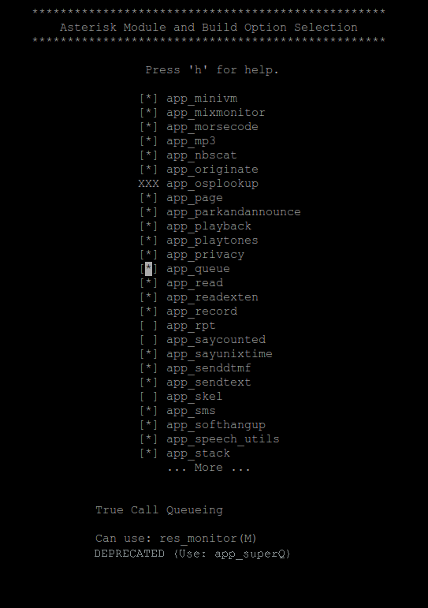
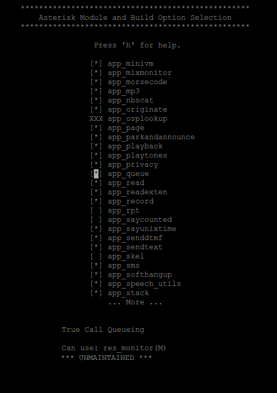
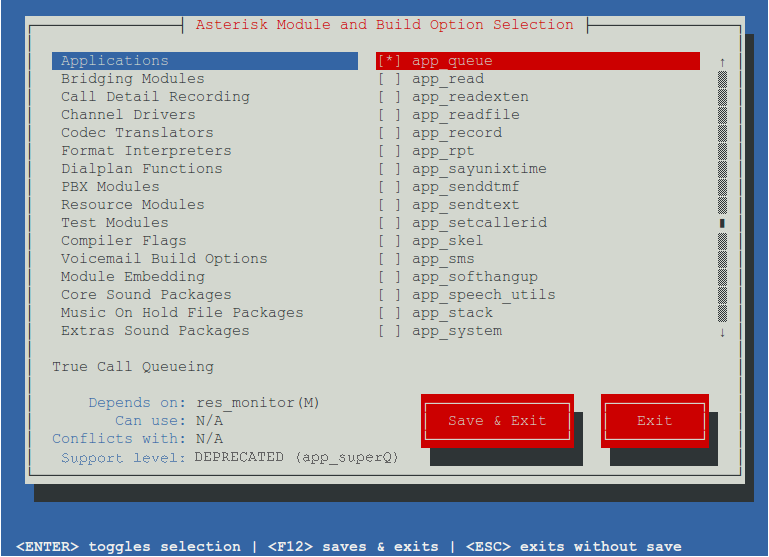

Introduction
============

In Asterisk, modules can take one of three supported states. These states include:

* Core
* Extended
* Deprecated

The definition of the various states is described in the following sections.

Core
----

Most modules in Asterisk are in the Core state, which means issues found with these modules can freely be reported to the Asterisk issue tracker, where the issue will be triaged and placed into a queue for resolution. Core modules are supported by both Sangoma and the community.

Extended
--------

This module is supported by the Asterisk community, and may or may not have an active developer. Some extended modules have active community developers; others do not. Issues reported against these modules may have a low level of support. For more information about which extended support modules have an active developer supporting them, see [Asterisk Open Source Maintainers.](/Development/Asterisk-Open-Source-Maintainers) Extended modules receive no bug fix support from Sangoma. Sangoma will try to ensure they continue to build and investigate security issues, but that is the extent of support.

Deprecated
----------

The module will remain in the tree, but there is a better way to do it. For module deprecation policy and process please see [Module Deprecation](/Development/Policies-and-Procedures/Module-Deprecation). Deprecated modules receive no bug fix support from Sangoma. Sangoma will try to ensure they continue to build and investigate security issues, but that is the extent of support.

MODULEINFO Configurations
=========================

At the top of modules there is the ability to set meta information about that module. Currently we have the following tags:

```
<defaultenabled>
<use>
<depend>
```

The meta data added to **MODULEINFO** in the module causes data to be generated in *menuselect*. For example, when you use ```<defaultenabled>no</defaultenabled>``` the module will not be selected by default. We would use the ```<defaultenabled>``` tag for *deprecated* modules so that they are not built unless explicitly selected by an Asterisk administrator.

Adding New Metadata
-------------------

On top of the existing tags, we would add two additional tags to communicate via menuselect that a module was extended or deprecated (and what module supersedes the deprecated module). These tags include:

- ```<support_level>```
	+ *Example: ```<support_level>deprecated</support_level>```*  --  This module would be deprecated. Maintenance of this module may not exist. It is possible this module could eventually be tagged as deprecated, or removed from the tree entirely.
- ```<replacement>```
	+ *Example: ```<replacement>func_odbc</replacement>```  --  The replacement for this module is the func_odbc module. This is used when the ```<support_level>``` is set to **deprecated**.

### Menuselect Display

The following two images show the suggested menuselect output based on the addition of the ```<support_level>``` and ```<replacement>``` tags. This would be a new line that has not been used before, and therefore would be added to menuselect as that new line.

If the **deprecated** value is used, then the value between the ```<replacement>``` tags will replace the value of *app_superQ* as shown in the image below. The text surrounding *app_superQ* would be static (same for all modules that used **deprecated**).



If the ```<support_level>``` tag is used, then the value of *extended* would cause the additional text of **EXTENDED** to be displayed.



Display in menuselect-newt for supported modules. If no ```<support_level>``` is specified, then it is assumed the module is supported:


Display in menuselect-newt for extended modules:


Display in menuselect-newt for deprecated modules:



