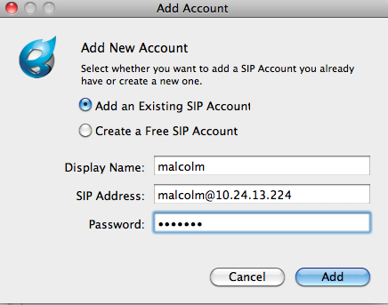
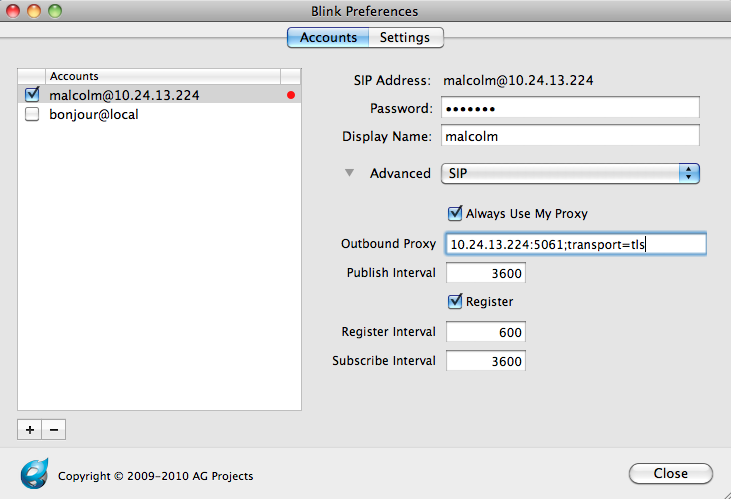
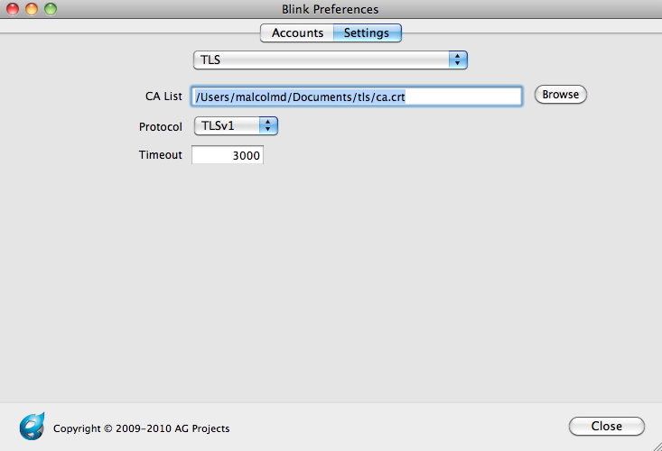
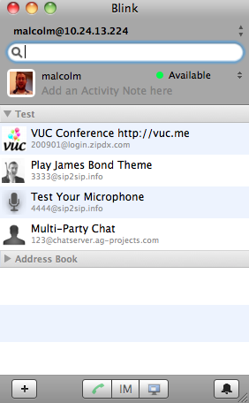
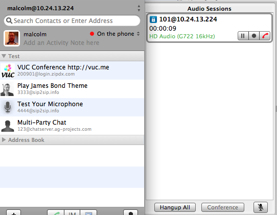
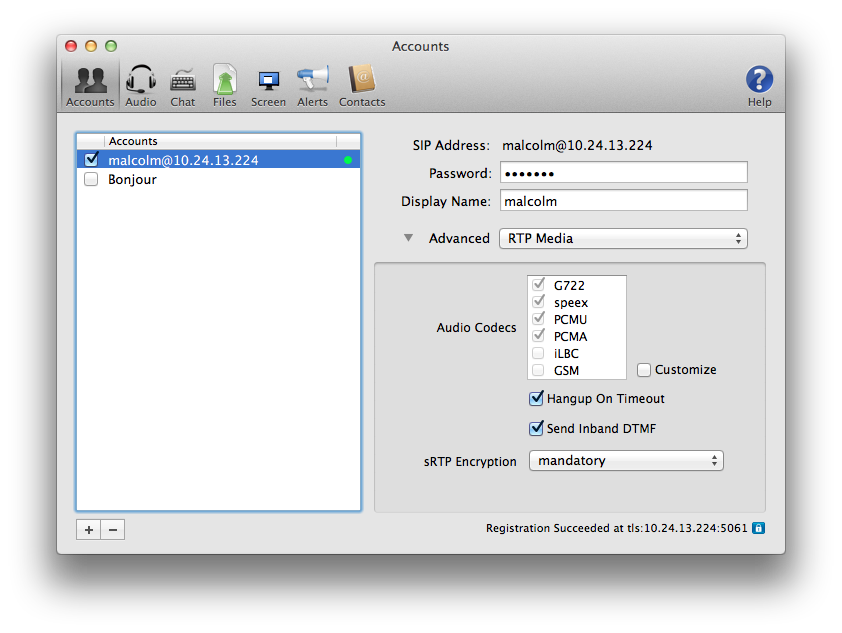
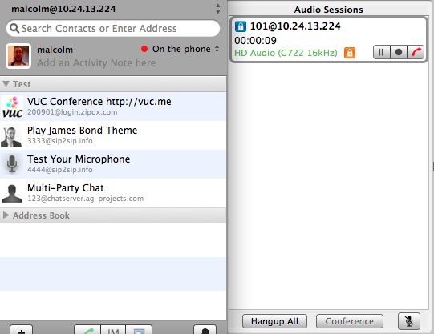

Overview
========


---

**Note:**  This tutorial makes use of SRTP and TLS. SRTP support was added in Asterisk 1.8, TLS was added in 1.6.

  


---


So you'd like to make some secure calls.

Here's how to do it, using [Blink](http://www.icanblink.com/), a SIP soft client for Mac OS X, Windows, and Linux. You can find some [brief instructions for installing Blink on Ubuntu](/Deployment/Secure-Calling/Secure-Calling-Tutorial/Installing-Blink-SIP-client) on the wiki.

These instructions assume that you're running as the root user (sudo su -).

Part 1 (TLS)
============

[Transport Layer Security](http://en.wikipedia.org/wiki/Transport_Layer_Security) (TLS) provides encryption for call signaling. It's a practical way to prevent people who aren't Asterisk from knowing who you're calling. Setting up TLS between Asterisk and a SIP client involves creating key files, modifying Asterisk's SIP configuration to enable TLS, creating a SIP peer that's capable of TLS, and modifying the SIP client to connect to Asterisk over TLS.

Keys
----

First, let's make a place for our keys.


---

  
  


```

mkdir /etc/asterisk/keys


```


---


Next, use the "ast\_tls\_cert" script in the "contrib/scripts" Asterisk source directory to make a self-signed certificate authority and an Asterisk certificate.


---

  
  


```

./ast\_tls\_cert -C pbx.mycompany.com -O "My Super Company" -d /etc/asterisk/keys -b 2048


```


---


* The "-C" option is used to define our host - DNS name or our IP address.
* The "-O" option defines our organizational name.
* The "-d" option is the output directory of the keys.
* The "-b" option specifies the size of the private key file, default is 1024 unless on master branch.
1. You'll be asked to enter a pass phrase for /etc/asterisk/keys/ca.key, put in something that you'll remember for later.
2. This will create the /etc/asterisk/keys/ca.crt file.
3. You'll be asked to enter the pass phrase again, and then the /etc/asterisk/keys/asterisk.key file will be created.
4. The /etc/asterisk/keys/asterisk.crt file will be automatically generated.
5. You'll be asked to enter the pass phrase a third time, and the /etc/asterisk/keys/asterisk.pem will be created, a combination of the asterisk.key and asterisk.crt files.

Next, we generate a client certificate for our SIP device.


---

  
  


```

./ast\_tls\_cert -m client -c /etc/asterisk/keys/ca.crt -k /etc/asterisk/keys/ca.key -C phone1.mycompany.com -O "My Super Company" -d /etc/asterisk/keys -o malcolm -b 2048


```


---


* The "-m client" option tells the script that we want a client certificate, not a server certificate.
* The "-c /etc/asterisk/keys/ca.crt" option specifies which Certificate Authority (ourselves) that we're using.
* The "-k /etc/asterisk/keys/ca.key" provides the key for the above-defined Certificate Authority.
* The "-C" option, since we're defining a client this time, is used to define the hostname or IP address of our SIP phone
* The "-O" option defines our organizational name.
* The "-d" option is the output directory of the keys."
* The "-o" option is the name of the key we're outputting.
* The "-b" option specifies the size of the private key file, default is 1024 unless on master branch.
1. You'll be asked to enter the pass phrase from before to unlock /etc/asterisk/keys/ca.key.

Now, let's check the keys directory to see if all of the files we've built are there. You should have:


---

  
  


```

asterisk.crt
asterisk.csr
asterisk.key
asterisk.pem
malcolm.crt
malcolm.csr
malcolm.key
malcolm.pem
ca.cfg
ca.crt
ca.key
tmp.cfg


```


---


Next, copy the malcolm.pem and ca.crt files to the computer running the Blink soft client.


---

**Tip: .p12 Client Certificates** If your client requires a .p12 certificate file instead, you can generate that using openssl like:


---

  
  


```

# openssl pkcs12 -export -out MySuperClientCert.p12 -inkey ca.key -in ca.crt -certfile asterisk.crt   


---


```


---


 

Asterisk chan\_pjsip configuration
----------------------------------

Now, let's configure Asterisk's PJSIP channel driver to use TLS.

In the **pjsip.conf** configuration file, you'll need to enable a TLS-capable transport.  An example of one would resemble:


---

  
  


```

[transport-tls]
type=transport
protocol=tls
bind=0.0.0.0:5061
cert\_file=/etc/asterisk/keys/asterisk.crt
priv\_key\_file=/etc/asterisk/keys/asterisk.key
method=sslv23

```


---


Note the **protocol**, **cert\_file**, **priv\_key\_file**, and **method** options.  Here, we're using the TLS protocol, we're specifying the keys that we generated earlier for **cert\_file** and **priv\_key\_file** and we're setting the **method** to SSLv23.

Next, you'll need to configure a TLS-capable endpoint.  An example of one would resemble:


---

  
  


```

[malcolm]
type=aor
max\_contacts=1
remove\_existing=yes
 
[malcolm]
type=auth
auth\_type=userpass
username=malcolm
password=useabetterpasswordplease
 
[malcolm]
type=endpoint
aors=malcolm
auth=malcolm
context=local
disallow=all
allow=g722
dtmf\_mode=rfc4733
media\_encryption=sdes
 

```


---


Note the **media\_encryption** option for the endpoint.  In this case, we've configured an endpoint that will be using SDES encryption for RTP.

You might be tempted to add a **transport=transport-tls**to the endpoint but in pjproject versions at least as late as 2.4.5, this will cause issues like **Connection refused** in a few situations.  Let pjproject do the transport selection on its own.  If you still see issues, set **rewrite\_contact = yes** in the endpoint configuration.

Asterisk chan\_sip configuration
--------------------------------

Or, if you are using chan\_sip, you can use the following to assist.

In the **sip.conf** configuration file, set the following:


---

  
  


```

tlsenable=yes
tlsbindaddr=0.0.0.0
tlscertfile=/etc/asterisk/keys/asterisk.pem
tlscafile=/etc/asterisk/keys/ca.crt


```


---


Here, we're enabling TLS support.  


Next, you'll need to configure a SIP peer within Asterisk to use TLS as a transport type. Here's an example:


---

  
  


```

[malcolm]
type=peer
secret=malcolm ;note that this is NOT a secure password
host=dynamic
context=local
dtmfmode=rfc2833
disallow=all
allow=g722
transport=tls


```


---


Notice the **transport** option. The Asterisk SIP channel driver supports three types: udp, tcp and tls. Since we're configuring for TLS, we'll set that. It's also possible to list several supported transport types for the peer by separating them with commas.

Configuring a TLS-enabled SIP client to talk to Asterisk
--------------------------------------------------------

Next, we'll configure Blink.

First, let's add a new account.



Then, we need to modify the Account Preferences, and under the SIP Settings, we need to set the outbound proxy to connect to the TLS port and transport type on our Asterisk server. In this case, there's an Asterisk server running on port 5061 on host 10.24.13.224.



Now, we need to point the TLS account settings to the client certificate (malcolm.pem) that we copied to our computer.


Then, we'll point the TLS server settings to the ca.crt file that we copied to our computer.



Press "close," and you should see Blink having successfully registered to Asterisk.



Depending on your Asterisk CLI logging levels, you should see something like:


---

  
  


```

 -- Registered SIP 'malcolm' at 10.24.250.178:5061
 > Saved useragent "Blink 0.22.2 (MacOSX)" for peer malcolm


```


---


Notice that we registered on port 5061, the TLS port.

Now, make a call. You should see a small secure lockbox in your Blink calling window to indicate that the call was made using secure (TLS) signaling:



Problems with server verification
---------------------------------

If the host or IP you used for the common name on your cert doesn't match up with your server then you may run into problems when your client is calling Asterisk. Make sure the client is configured to **not** verify the server against the cert.

When calling **from** Asterisk to Blink or another client, you might run into an ERROR on the Asterisk CLI similar to this:


---

  
  


```

[Jan 29 16:04:11] DEBUG[11217]: tcptls.c:248 handle\_tcptls\_connection: SSL Common Name compare s1='10.24.18.124' s2='phone1.mycompany.com'
[Jan 29 16:04:11] ERROR[11217]: tcptls.c:256 handle\_tcptls\_connection: Certificate common name did not match (10.24.18.124)

```


---


This is the opposite scenario, where Asterisk is acting as the client and by default attempting to verify the destination server against the cert.

You can set **tlsdontverifyserver=yes** in sip.conf to prevent Asterisk from attempting to verify the server.


---

  
  


```

;tlsdontverifyserver=[yes|no]
; If set to yes, don't verify the servers certificate when acting as
; a client. If you don't have the server's CA certificate you can
; set this and it will connect without requiring tlscafile to be set.
; Default is no.

```


---


 

Part 2 (SRTP)
=============

Now that we've got TLS enabled, our signaling is secure - so no one knows what extensions on the PBX we're dialing. But, our media is still not secure - so someone can snoop our RTP conversations from the wire. Let's fix that.

SRTP support is provided by libsrtp. libsrtp has to be installed on the machine before Asterisk is compiled, otherwise you're going to see something like:


---

  
  


```

[Jan 24 09:29:16] ERROR[10167]: chan\_sip.c:27987 setup\_srtp: No SRTP module loaded, can't setup SRTP session.


```


---


on your Asterisk CLI. If you do see that, install libsrtp (and the development headers), and then reinstall Asterisk (./configure; make; make install).

With that complete, let's first go back into our peer definition in **sip.conf.** We're going to add a new encryption line, like:


---

  
  


```

[malcolm]
type=peer
secret=malcolm ;note that this is NOT a secure password
host=dynamic
context=local
dtmfmode=rfc2833
disallow=all
allow=g722
transport=tls
encryption=yes
context=local


```


---


Next, we'll set Blink to use SRTP:



Reload Asterisk's SIP configuration (sip reload), make a call, and voilà:



We're making secure calls with TLS (signaling) and SRTP (media).

