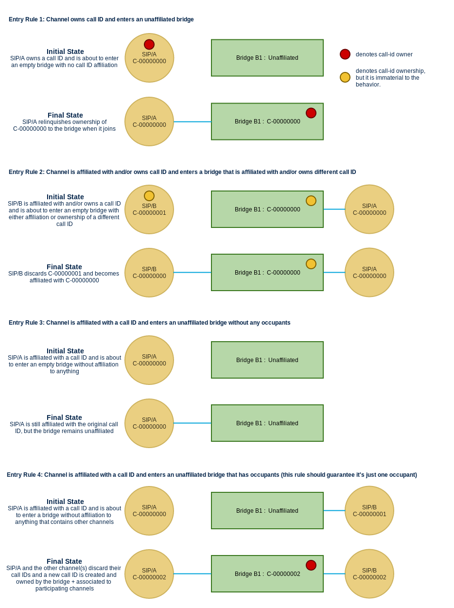
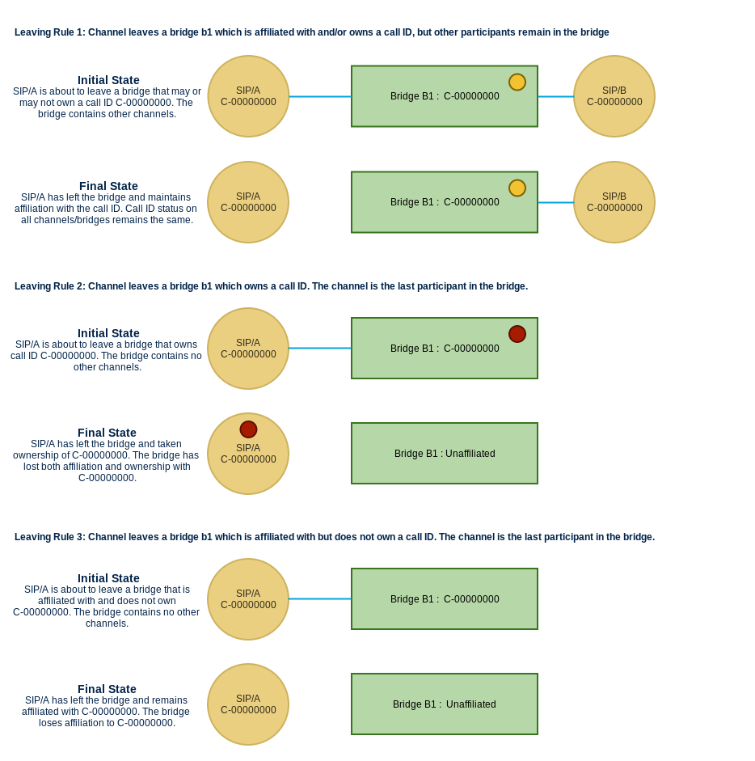
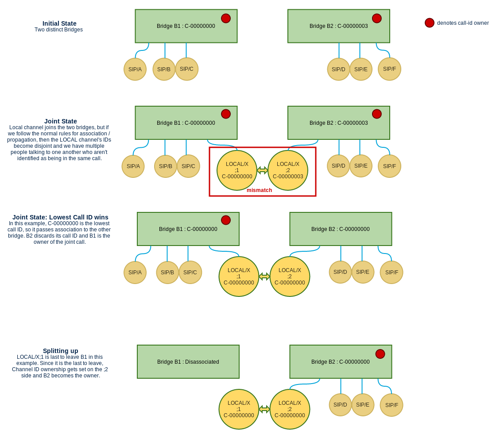
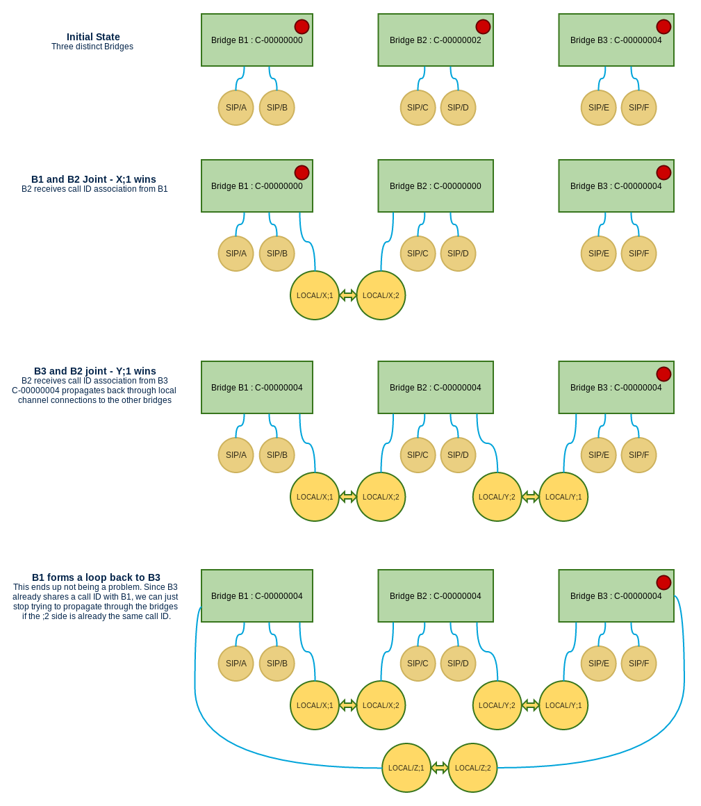

!!! note 
    This is an Asterisk-specific concept. Not to be confused with Caller-ID or a SIP 'Call-ID' field. 

      
[//]: # (end-note)

What is a call?
===============

This might seem like a silly question, but it is one with a considerable amount of nuance. In the most simple scenario, party A calls party B and they are both in a call together. Things get more complicated when considering advanced features of bridges in Asterisk. What if multiple parties join the same conference?  They each called Asterisk separately, but they are ultimately connected to each other and talking to each other. Frequently people refer to two parties in a conference as being in 'a conference call'. It's not the case though that two parties are in the same call simply because they share a bridge in Asterisk. Two channels can be in the same parking bridge or another type of holding bridge for instance, but those two channels can't be said to be in a call together. There is no communication flowing between them and the parties are generally unaware of each other. At the same time, two channels can be bridged together and be part of the same call and then independently leave the bridge and enter dialplan. From the perspective of each of them, their call hasn't ended. Effectively, the same call has forked into two separate calls. If at some point before these channels hang up, they end up being in communication with other channels, the one call has effectively become two separate calls (arguably three if you count the original as a separate conversation) spread across numerous channels, but the first call never terminated from the perspective of either party.

It's pretty clear that we need a concrete definition of what constitutes a call and what doesn't.

What starts a call and when does a channel cease to be involved with a call
---------------------------------------------------------------------------

(note: for call ownership purposes, we are only referring to communication type bridges such as simple, native RTP, mixing, etc and not to holding bridges – holding bridges are not considered to link multiple parties together even if multiple parties reside in the same holding bridge)

A call begins when a new line of communication is started. This can be one endpoint calling another endpoint or it can just be an endpoint calling into Asterisk for some feature (such as voicemail or a Stasis application). The channel is effectively the owner of the call until it either hangs up, the channel becomes involved with another existing call, or the active call ceases to involve only a single party. A call should only involve one active line of communication, however if parties split from that call they will continue to remain affiliated with call until they enter a new multiparty line of communication (so if A, B, and C are talking in one call and C leaves to go look at voicemail, C will still be considered part of that call until it leaves voicemail.  If it enters a new bridge afterwards, it will either take on that bridge's call ID or it will start a new call while it waits for other parties to join the bridge). If two parties are in a call together and then cease to communicate with one another but still persist elsewhere. A call is effectively over when there are no longer entities affiliated with that call ID even if channels that were once involved with that call still exist.

This introduces the concept of call ownership vs call affiliation. Ownership of a call may pass from a channel to a bridge and vice versa, but only one entity may own a call at a time.  Affiliation on the other hand can be shared by any number of channels. Ownership implies affiliation, but obviously not the inverse. If a channel/bridge is affiliated with a call, log messages pertaining to that channel/bridge should contain that call's Call ID whenever it is practical to do so (I can guarantee we will miss some instances of this).

#### Bridging Scenarios:

Entry:

* Channel C1 owns call X1 and enters an unaffiliated bridge B1:
* Channel C1 is affiliated with and/or owns call X2 and enters bridge B1 affiliated with (may or may not own) X1:  
C1 loses affiliation/ownership with X2 and affiliates with X1.
* Channel C1 is affiliated with (but does not own) X1 and enters an unaffiliated bridge B1 without other occupants:  
B1 remains unaffiliated. C1 maintains affiliation with X1.
* Channel C1 is affiliated with (but does not own) X1 and enters an unaffiliated bridge B1 with other occupants:  
B1 creates and owns a new call ID. C1 and all other occupants gains affiliation with the new call ID.

Leaving:

* Channel C1 leaves bridge B1 affiliated with X1 (may or may not own). B1 contains other channels and C1 is not the last to leave:  
C1 remains affiliated with X1. B1 keeps ownership of X1 if it owns X1. If not, it remains affiliated.
* Channel C1 leaves bridge B1 which owns X1. C1 is the last remaining channel in the bridge when it leaves:  
C1 takes ownership of X1. The bridge becomes unaffiliated with X1.
* Channel C1 leaves bridge B1 which is affiliated (does not own) with X1. C1 is the last remaining channel in the bridge when it leaves.  
C1 remains affiliated with X1. B1 discards affiliation with X1.

Note that unreal/local channels will create a significant deviation from the above behavior since they are able to link bridges to other bridges

Unreal/Local channels make everything more complex
--------------------------------------------------

A quick recap for those who are unfamiliar or uninitiated with local channels, local channels come in pairs and they are connective in nature. Every local channel has two channels associated with it, the ;1 end and the ;2 end. These two channels exist somewhat independently, and media pushed into one becomes media pushed out to the other side.  For the purpose of what we have defined as a call, this means they can fulfill some of the purposes of a bridge in the above scenario. This gets complicated when you realize that two independent bridges may effectively become part of a single call going by our definition above.

When two bridges are joined together by a local channel (or worse, a chain of local channels), the following needs to be true for our definition of a call to hold:

* Local channels that form a single path of communication (;1 and ;2 and any chains that may exist) should maintain a single call ID if possible.
* The bridges that a local channel is involved with must have the same call ID as the local channels that are in them
* The channels involved with the bridges that the local channel is involved with must also share the same call ID.

This means that we need to work out some propagation rules for when local channels enter and/or bridge. This gets extra difficult when you consider the following:

1. More than one local channel may be in a bridge. You might even have multiple ;1 or multiple ;2 ends in the same bridge, so propagating based on ;1 or ;2 priority might not be feasible.
2. Local channels may exist in a chain, and currently we can only propagate across local channel chains in a single direction.

In order to ensure that all bridges linked by local channels can maintain a single call ID, we need to establish rules for determining a winner. Some possibilities for these rules include:

* If multiple bridges are linked with local channels, the lowest call ID among the bridges wins and becomes associated with all other bridges and all other channels in bridges  
Implementing this rule may be difficult due to the inability to bi-directionally propagate things through chains of local channels, but there may be a way to mitigate this.
* The first ;1 channel in a local channel / local channel chain could always win. This is problematic when more than two bridges are joined via local channels  
since there is currently no guarantee of a bridges being joined in a tree-like fashion.  Call IDs could get propagated to one bridge from multiple sources with no means of  
then propagating them back to the bridges that provided the earlier call ID which would result in a mismatched call.

If a bridge isn't connected to the call, it should no longer be affiliated with that call ID.  At that point, if there aren't any channels in the bridge we should just drop affiliation. Otherwise this should be considered a new call and those entities need to be affiliated with a new call ID.  At that point, the bridge would create a new call ID and take overship of it.

 

The diagram below shows a simple case of call ID linking and separating between bridges via local channels. This diagram is written with the assumption that lowest call ID is used.

 

The following diagram demonstrates how multiple bridge chains and loops might function when the ;1 wins rule is used. 

 

Tests:
======

Some of these tests may require the addition of CHANNEL(callid) to the CHANNEL function – technically a new feature and may only be allowed in trunk.

Basic Calls - either 0 or 1 bridges related to call IDs involved (holding bridges may be involved as well but do not count towards total)
-----------------------------------------------------------------------------------------------------------------------------------------

#### Test 1: Calls into PBX, no bridging

1. A calls into PBX and receives call ID C-00000000
2. B calls into PBX and receives call ID C-00000001
3. C calls into PBX and receives call ID C-00000002

The dialplan for each call should play some audio and then exit. Confirm that the call ID matched the expectations prior to the playback and in a hangup handler – call IDs are supposed to be set either before entering PBX or in cases when channel drivers don't apply them, immediately upon entering the PBX.

#### Test 2: Basic calls between two parties

1. A dials B - nothing fancy, verify both ends have C-00000000
2. C dials D - predial handler on D to confirm that it immediately has C-00000001, verify both ends are bridged with C-00000001
3. E dials F - option enabled on E so that it goes on after F hangs up. Verify both ends have C-00000002 and that E keeps this call ID after leaving the bridge.
4. G dials H - option enabled on H so that it goes on after G hangs up. Verify both ends have C-00000003 and that H keeps this call ID after leaving the bridge.

#### Test 3: Conference

1. A calls into a conference - received C-00000000
2. B calls into the same conference - starts as C-00000001, becomes C-00000000 upon joining the conference, leaves the conference and keeps C-00000000
3. C calls into the same conference - starts as C-00000002, becomes C-00000000 upon joining the conference, leaves the conference and keeps C-00000000

#### Test 4: Call Parking

1. A calls B - receives C-00000000
2. B parks A via blind transfer to 700. Verify that A is still C-00000000 while in the parking lot
3. Repeat the process, C calls B, receives C-00000001, B parks C to the same lot, verify that C is still C-00000001 (even though it is in the same bridge as A, they aren't communicating)
4. Allow both parks to time out.  Verify that they still have their respective call IDs on exit.

Calls with Transfers
--------------------

#### Test 1: DTMF Blind Transfer

1. A calls B with options 'tT' set - both are C-00000000
2. A transfers B to C via DTMF blind transfer. C also receives C-00000000

No item of this test should receive a call ID higher than C-00000000

#### Test 2: DTMF Attended Transfer

1. A calls B with options 'tT' set - both are C-00000000
2. A starts transfer to C via DTMF attended transfer. C as well as all channels involved in the transfer (local channel ;1 and ;2) should receive C-00000000 as well because A's original channel is the dialer of C.
3. A completes transfer, B and C are now bridged and both have C-00000000

No item of this test should receive a call ID higher than C-00000000

#### Test 3: DTMF Attended Transfer to 3 way call

1. A calls B with options 'tT' set - both are in C-00000000
2. A starts transfer to C via DTMF attended transfer. C as well as all channels involved in the transfer (local channel ;1 and ;2) should receive C-00000000 as well because A's original channel is the dialer of C.
3. A finishes transfer as a three way call, A, B, and C are now bridged together with C-00000000.

No item of this test should receive a call ID higher than C-00000000

#### Test 4: SIP Blind Transfer

1. A (a PJSIP channel) calls B - both are C-00000000
2. A performs SIP blind transfer of B to C - both are C-00000000

No item of this test should receive a call ID higher than C-00000000

#### Test 5: SIP Attended Transfer

1. A (a PJSIP channel) calls B - both are C-00000000
2. A starts a SIP attended transfer to C. This is a separate call from Asterisk's perspective, so it receives C-00000001
3. A completes the transfer. B and C are now bridged. B should take on C-00000001 since it joined C's bridge.

Multi-call participation - a single channel becomes involved in multiple calls
------------------------------------------------------------------------------

#### Test 1: Parked Call Retrieval

1. A calls B, B Parks A - Call ID for all channels involved is C-00000000 from start to this point.
2. C calls B's parked extension and the two are now bridged in a call together. C is responsible for the new bridge, so B adopts C-00000001 (which C had on entering PBX)

#### Test 2: Stasis Bridge Shuffle

1. A, B, C, and D call into a stasis application. Each owns a unique call ID based on order of entry.
2. Bridges B1, B2, B3, and B4 are created via ARI
3. A is added to B1 - B1 takes ownership of C-00000000
4. B is added to B1 - B discards C-00000001 and associates with C-00000000
5. A is pulled from B1 - remains associated with C-00000000 (does not regain ownership since it isn't the last channel out of B1)
6. B is pulled from B1 - takes ownership of C-00000000. B1 discards association to C-00000000 and becomes unaffiliated.
7. A is added to B2 - Since A is affiliated but lacks ownership and B2 is unoccupied by other channels, B2 should not become affiliated.
8. C is added to B2 - Since C owns C-00000002, C-00000002 ownership is passed to the bridge. A associates with C-00000002, C maintains association to C-00000002.
9. A is pulled from B2 - remains associated with C-00000002
10. B joins B3, D joins afterwards - Both are C-00000000
11. B is pulled from B3 - remains associated with C-00000000
12. A is added to B4 - remains associated with C-00000002
13. B is added to B4 - Since two channels are now in B4 and none of them own a call ID, a new call ID is created for the bridge and associated to both channels (C-00000004)

This test demonstrates application of all the bridge entry and exit rules that don't involve local channels.

Linking Bridges via local Channels
----------------------------------

Note: A decision needs to be made about the call ID preferences for linked bridges before behavior can be nailed down for these tests.

 

Other Considerations
--------------------

* Holding Bridges - A holding bridge can service multiple channels that aren't really connected and probably shouldn't be considered to be part of a call. It might not  
be appropriate to bind them to a Call-ID and instead it may be preferable to leave ownership of the call ID with the channel in this case.
* Persistent Bridges - If something like an ARI application is used to create a bridge, it might be more appropriate for it to receive a call ID independent from channels  
joining and leaving and for it not to give up ownership to the last channel that leaves the bridge. This might also apply for something like a conference bridge, though  
that is questionable. Under the currently proposed model, if all channels leave a conference bridge and then a new one enters that is effectively a new conference  
and a new call.

 

