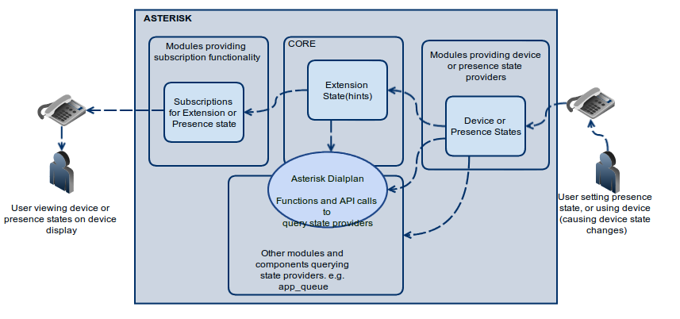

Asterisk includes the concepts of [Device State](/Device-State) , [Extension State](/Extension-State-and-Hints) and [Presence State](/Presence-State) which together allow Asterisk applications and interfaces to receive information about the state of devices, extensions and the users of the devices.

As an example, channel drivers like chan\_sip or res\_pjsip/chan\_pjsip may both provide devices with device state, plus allow devices to [subscribe to hints](/Extension-State-and-Hints) to receive notifications of state change. Other examples would be app\_queue which takes into consideration the device state of queue members to influence queue logic or the Asterisk Manager Interface which provides actions for [querying extension state and presence state](/Querying-and-Manipulating-State).

In This SectionSee Also[Distributed Device State](/Distributed-Device-State)

[Publishing Extension State](/Publishing-Extension-State)

[Exchanging Device and Mailbox State Using PJSIP](/Exchanging-Device-and-Mailbox-State-Using-PJSIP)

Additionally, modules exist for [Corosync](/Corosync) and [XMPP PubSub](/Distributed-Device-State-with-XMPP-PubSub) support to allow device state to be [shared and distributed](/Distributed-Device-State) across multiple systems.

The sub-sections here describe these concepts, point to related module specific configuration sections and discuss [Querying and Manipulating State](/Querying-and-Manipulating-State) information.

The figure below may help you get an idea of the overall use of states and presence with the Asterisk system. It has been simplified to focus on the flow and usage of state and presence. In reality, the architecture can be a bit more confusing. For example a module could both provide subscription functionality for a subscriber and be the same module providing the devices and device state on the other end.

